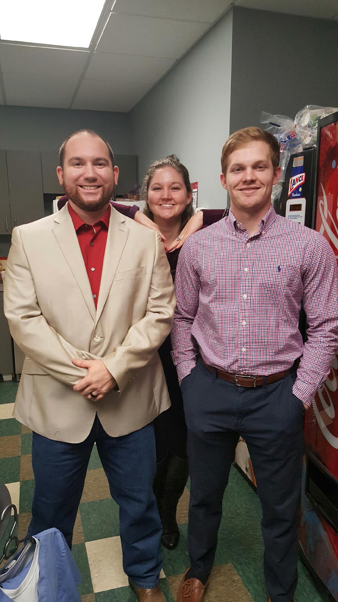

<!-- Home -->
<!--  -->

## Education
- Cardiology Fellowship
    - Charleston Area Medical Center (CAMC) | Charleston, WV
    - July 2024 – July 2027
- Chief Resident
    - 3rd Year Chief Resident
    - Charleston Area Medical Center (CAMC) | Charleston, WV
    - July 2023 – July 2024
- Internal Medicine Residency
    - Charleston Area Medical Center (CAMC) | Charleston, WV
    - July 2021 - July 2024
- Doctor of Osteopathic Medicine (DO)
    - LMU-DCOM | Harrogate, Tennessee
    - July 2017 – May 2021
- Undergraduate Coursework
    - University of Tennessee – Knoxville | Knoxville, TN
    - August 2012 – May 2016
    - 1st year Course work in Engineering
    - Completed 127 credit hours towards a Bachelor’s degree in Mathematics

## Leadership Experiences
- Chief Resident
    - Charleston Area Medical Center (CAMC) | Charleston, WV
    - July 2023 – July 2024
- Cerner Training/Onboarding
    - Charleston Area Medical Center (CAMC) | Charleston, WV
    - June 29, 2022; June 30, 2023
- APDIM Chief Residents Meeting - Academic Internal Medicine Week
    - Austin Convention Center | Austin, TX
    - April 2-5, 2023

## Academic Endeavors
- 2023 Internal Medicine Guide
    - Charleston Area Medical Center (CAMC) | Charleston, WV
    - August 2022 - Present
- Presentations
    - Journal Club
        - Statins in ESRD - 10/18/2022
    - Morning Report
        - CIEDs - 09/29/2022
        - ALF/DILI - 10/04/2022
    - Quality Improvement
        - Project: AMD – 03/23/2022
- PGY-2 Development Curriculum/Bootcamp
    - Residents as Teachers & Feedback in the Hospital – 06/22/2023
    - How to Navigate Night Float as a PGY-2 – 06/21/2023
    - Upper Leveling 101 – 06/19/2023
- Orientation to Presenting on Rounds
    - WVSOM | Charleston, WV
    - Taught upcoming 3rd year medical students the components of an oral presentation on hospital rounds
    - Evaluated and gave feedback regarding presentation skills
    - June 2022

## Research Experience
- CAMC Research Day Oral Presentation – Clinical Research/QI Abstract
    - 2024 CAMC Research Day | Roanoke, WV
    - Co-Investigator
    - Case: Evaluating Resident and Patient Satisfaction by Creating a Polypharmacy Clinic in an Internal Medicine Residency Program
    - CAMC Department of Internal Medicine
    - PI: Amna Anees, MD, Program Director, Department of Internal Medicine
    - April 2024
- WV ACP Poster – Clinical Research/QI Abstract
    - 2023 ACP WV Chapter Annual Scientific Meeting | Roanoke, WV
    - Co-Investigator
    - Case: Evaluating Resident and Patient Satisfaction by Creating a Polypharmacy Clinic in an Internal Medicine Residency Program
    - CAMC Department of Internal Medicine
    - PI: Amna Anees, MD, Program Director, Department of Internal Medicine
    - November 11, 2023
- WV ACP Poster – Case Report
    - 2023 ACP WV Chapter Annual Scientific Meeting | Roanoke, WV
    - Co-Investitgator
    - Case: Name that Rash: Delayed Dermatomyositis Identification and its Sequela
    - CAMC Department of Internal Medicine
    - PI: Dr. Ahsan Iqbal, MD, Rheumatology, Department of Rheumatology
    - November 11, 2023
- WV ACP Oral Presentation - Theives Market
    - 2023 ACP WV Chapter Annual Scientific Meeting | Roanoke, WV
    - 1st Author
    - Case: Drug-Induced ANCA-Associated Vasculitis
    - CAMC Department of Internal Medicine
    - November 10, 2023
- WV ACP Oral Presentation - Case Report
    - 2023 ACP WV Chapter Annual Scientific Meeting | Roanoke, WV
    - 1st Author
    - Case: “My Neck, My Back, Antibodies on the Attack”: A case of Statin-Associated Immune-Mediated Necrotizing Myopathy
    - CAMC Department of Internal Medicine
    - PI: James R. Campbell II, MD, Interim Associate Vice President for Health Sciences, Charleston Campus and Interim Dean, WVU School of Medicine, Charleston Campus; Associate Professor & Department Chair, Department of Internal Medicine - Charleston Campus
    - November 10, 2023
- WV ACC Poster – Case Report
    - WV ACC Annual Meeting – Waterfront Place | Morgantown, WV 
    - 1st Author
    - Case: Pericarditis associated with a Pericardial Cyst
    - CAMC Department of Internal Medicine
    - PI: Dr. David D. Francke, MD, Cardiology, Department of Cardiology
    - August 26, 2023
- WV ACC Poster – Case Report
    - WV ACC Annual Meeting – Waterfront Place | Morgantown, WV 
    - 1st Author
    - Case: Oh My! Mycoplasma Pneumoniae Myocarditis
    - CAMC Department of Internal Medicine
    - PI: Dr. Sarah J. Rinehart, MD, Program Director, Department of Cardiology
    - August 26, 2023
- Prospective Observational Study – IRB Approved - Ongoing
    - Charleston Area Medical Center | Charleston, WV
    - Co-Investigator
    - Project: Acetazolamide use in Outpatient HF Management
    - CAMC Department of Internal Medicine/Cardiology
    - PI: Dr. Marciano Lee, MD, Cardiology, Heart Failure
    - 01/2023 – Present
- WV ACP Oral Presentation - Cross-Sectional Observational Study
    - WV ACP Annual Meeting – Stonewall Resort | Roanoke, WV
    - Co-Investigator
    - Project: Words Matter: The Impact of Language on Healthcare Provider Clinical Judgment
    - Department of Internal Medicine/Psychiatry
    - PI: Dr. Adina Bowe, MD, Psychiatry, Director of Comprehensive Opioid Addiction Treatment Clinic and Assistant Professor
- Prospective Study – IRB Approved - Ongoing
    - Charleston Area Medical Center | Charleston, WV
    - Co-Investigator
    - Project: Impact of Communication Modality on Heart Failure Clinic Follow Up
    - CAMC Department of Internal Medicine/Cardiology
    - PI: Dr. Marciano Lee, MD, Cardiology, Heart Failure
    - 02/2022 – Present
- Quality Improvement
    - Charleston Area Medical Center | Charleston, WV
    - Project: Improving AMD documentation in IM Clinic Patients ≥60 y/o
    - CAMC Department of Internal Medicine
    - PI: Dr. J Anwar, MD, Internal Medicine	
    - 11/2021 – Present
- Research Day Poster – Case Report
    - Charleston Area Medical Center | Charleston, WV
    - Co-Investigator/Presenter
    - The Confused Crab: Hyperammonemic Encephalopathy as an initial presentation of Multiple Myeloma
    - CAMC Department of Internal Medicine
    - PI: Dr. R. Scott Morehead, MD, Pulmonology and Critical Care
    - April 19, 2022

## Work Experience
- Internal Moonlighting
    - Worked with GME and hospital administration to allow internal moonlighting and create a pathway within CAMC to allow this for other residents
    - Included Neurology and MRI Observation
- Ophthalmic Assistant
    - Regional Eye Center | Kingsport, TN
    - Worked independently to prepare patients for their visit by performing preliminary eye exams
    - Conducted diagnostic testing via fundus photography, topography, and visual field assessment
    - Assisted physicians as a scribe by properly documenting exam findings
    - P5/2015 – 08/2015, 12/2015 – 01/2016, 07/2016 – 07/2017
- Teaching Assistant/Peer Mentor, First Year Studies 101
    - University of Tennessee | Knoxville, TN
    - Semester-long course for incoming freshmen created to provide guidance and the means to thrive while at UT
    - Graded assignments, assisted class activities, and served as an in-class liaison
    - Fall 2013, 2014, and 2015	

## Volunteer Experience and Community Activities
- Project CHASM (Charleston Homeless and Street Medicine)
    - WVU | Charleston, WV
    - Check blood pressures, provide basic toiletries, and other necessities twice monthly
    - Provide compassionate care at the men’s group home and women’s shelter in downtown Charleston
    - April 2022 - Ongoing
- Hospital Flu Shot and COVID-19 Contact Tracing Volunteer
    - Tennova Turkey Creek Medical Center | Knoxville, TN
    - Assist pharmacy staff by administering flu shots to hospital staff on a weekly basis
    - Assist the human resources department by contact tracing COVID-19 positive patients
    - October 2020	
- Clinical Rotations Student Assessment Team Volunteer
    - LMU-DCOM | Knoxville, TN
    - Met with rotation staff from multiple rotation sites to assess the current third year curriculum
    - Received feedback from peers to adjust current curriculum
    - Created and submitted recommended changes to the assessment staff
    - February 2020
- Clean-up Crew Volunteer
    - Girls Inc. | Kingsport, TN
    - General facility maintenance in preparation for after school activities
    - Repainted and resurfaced the schoolyard, cleared brush and improved the facility’s exterior
    - Fall 2014, Fall 2019
    - February 2020
- Student Peer Mentor
    - LMU-DCOM | Harrogate, TN
    - Provided guidance and served as a source of answers to an incoming medical student
    - Attended regular meetings and mentoring events
    - Recommended resources tailored to each course
    - 2018, 2019
- 6th Grade Assistant Football Coach
    - Boys and Girls Club of Greater Kingsport | Kingsport, TN
    - Assisted in practices and games on a bi-weekly basis
    - Independently coached defensive backs and wide receivers
    - Implemented known techniques to improve skill, Led individual drills
    - Fall 2016

## Hobbies
- Intramural Sports/College Olympics
    - LMU-DCOM | Harrogate, TN
        - Football, Soccer, and Dodgeball
        - Dodgeball Champion
    - University of Tennessee | Knoxville, TN
        - Football, Racquetball, Floor hockey, and Basketball
- Microsoft Word/Excel/PowerPoint – Expert
- Snowboarding – Advanced
- Cerner - Advanced
- Python, HTML, CSS- Intermediate
- Javascript - Working

## Honors and Awards
- 1st Place Clinical Research/QI Resident Abstract Poster Competition
    - 2023 ACP WV Chapter Annual Scientific Meeting | Roanoke, WV
    - 11/11/2023
- Outstanding Contribution to Quality Improvement Projects - 2022-2023
    - Charleston Area Medical Center | Charleston, WV
    - For contributions to QIPs 2022-2023
- Outstanding Contribution to Quality Improvement Project - Quarter 1
    - Charleston Area Medical Center | Charleston, WV
    - For contributions to AMD QIPs	Fall 2021
- Dean’s List
    - University of Tennessee | Knoxville, TN
    - Fall 2012, 2013, and 2014, Spring 2015 and 2016
- Dobyns-Bennett Quarterback Club Scholarship
    - Dobyns-Bennett Highschool | Kingsport, TN
    - Single year college scholarship for my position as a team captain and my academic record.
    - Fall 2012 – Spring 2013

