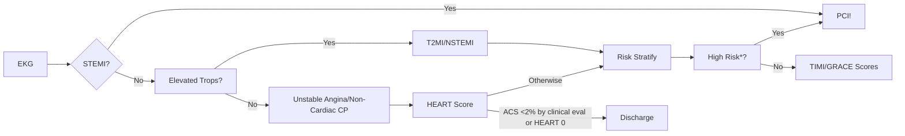

## Approach to Chest Pain

- Onset, Location, Duration, Characterization
    - Modifying factors
- [Chest Pain in the ED (M4s)][1]
- [Chest Pain Guideline Central][5]

### Classifying Angina

- Angina Pectoris: Chest pain due to >70% stenosis
- Classic/Cardiac (Typical Angina): All 3 of the following
    - 1) Typical location (substernal), quality (dull), and duration
        - Quality: Squeezing, tightness, pressure, constriction, fullness, heaviness, and weight
        - Clenches fist over mid-sternal area
        - Often radiates to the left shoulder, neck, or arm
        - Builds in intensity over a few minutes (2-30mins)
            - <2 mins: not MI
            - 2-5 minutes: Stable angina
            - more than 30mins: MI
    - 2) Provoked by exercise or emotional stress
    - 3) Relieved by rest or nitroglycerin
- Atypical Angina (Possibly Cardiac): only 2 of the 3 above
- Non-anginal: <2 of the 3 above

### Pulmonary/Pleuritic Chest Pain (pleurisy, pneumonia, pericarditis, PE)

- Sharp/stabbing pain, worse with inspiration
- Pericarditis is worse when lying flat, breathing
    - No chest wall pain
    - TTE to assess for pericardial effusion
- Pneumothoraxes have respiratory distress/hypoxia/tachycardia
    - Pleuritic chest pain and or dyspnea
    - Peripheral or apical radiolucency, absence of lung markings beyond the lung edge
- PE
    - Sudden onset dyspnea and pleuritic chest pain
    - Tachypnea, tachycardia, cough, hemoptysis +/- LE swelling
    - CXR: atelectasis, infiltrates, pleural effusions, Westermark’s Sign (peripheral hyperlucency due to oligemia)
- Viral Pleurisy: inflammation of the lung pleura that presents with fever and pleuritic chest pain
    - Pleural friction rib may be present (disappears with breath holding, pericardial friction rub does not)
- ESR elevated in SLE Pleuritis, Not tenderness to palpation
- CXR/Chest CT

### Aortic (dissection, intramural hematoma)

- Sudden, severe tearing pain, radiates to back, elderly, hypertension/atherosclerosis, tachycardia
- Irregular aortic contour with inward displacement of atherosclerotic calcification
- No tenderness to palpation
- Chest CT

### GI Disease (Spasm/GERD/Ulcer)

- Esophageal Spasm
    - 5-60 minutes
    - Visceral, spontaneous, substernal, associated with cold liquids, relief with nitro
- Gastric Esophageal Reflux Disease (GERD)
    - 5-60 minutes
    - Non-pleuritic, Non-exertional/no pain with movement, worse with recumbency, visceral/burning, relieved by antacids or food, cough, hoarseness due to aspiration, upper abdominal/substernal, associated with regurgitation, nausea, dysphagia, nocturnal pain, non-radiating
    - Reflux may improve with siting up
    - Endoscope +/- pH testing

### Chest wall/Musculoskeletal (MSK) chest pain

- Persistent and or prolonged pain, worse with movement or position change, often follows repetitive activity
- Costochondritis
    - Most common cause of MSK chest pain
    - RF: Strenuous exercise, joint aggravation (weightlifting)
    - Sharp, localized chest pain that worsens with inspiration/movement/coughing and tender to palpation of ≥1 anterior chondral joint
        - Either costochondral or sternochondral joints
        - No swelling, no tachycardia/bradycardia
    - Usually benign and self-limiting and resolves in weeks, but may last >1 year
    - Normal EKG and CXR
    - Treatment
        - Reassurance and symptomatic pain management

## Differential

- Rule out the scary things 1st:
    - MI
    - PE
    - Esophageal Rupture
    - Aortic Dissection
    - Pneumothorax

## Work-up

- EKG, CXR, Troponin(s)
    - +/- D-Dimer/CTA/TTE
- [2021 AHA/ACC Guideline for the Evaluation and Diagnosis of Chest Pain][2]

### EKG

- Best test is EKG followed by Cardiac Enzymes every 8 hours (3 sets needed)
    - Nonischemic ECG and negative biomarkers at 0 hr and 3 hr reduces risk of MACE to less than 1%
        - [Stress-testing cannot decrease risk beyond <1% (not warranted)][4]
    - Used to rule in or rule out STEMI

### Troponin

- Causes of Troponin Elevation not related to Acute MI
    - Other causes of myocardial injury
        - Cardiac
            - Heart Failure
            - Myocarditis
            - Cardiomyopathy of any type
            - Takotsubo Syndrome
            - Cardiac Contusion
        - Systemic
            - Sepsis
            - CKD
            - Stroke, subarachnoid hemorrhage
            - PE, PHTN
            - Infiltrative Disease
            - Chemotherapy
            - Critical illness
            - Strenuous exercise
    - Myocardial injury related to acute myocardial ischemia because of oxygen supply/demand imbalance
        - Reduced myocardial perfusion
            - Coronary Spasm
            - Coronary Embolism, Coronary Artery Dissection
            - Sustained Bradyarrhythmia
            - Hypotension or Shock
            - Respiratory Failure
            - Severe Anemia
        - Increased myocardial demand
            - Tachycardia
            - Severe HTN w/ + w/o LVH

## Risk Stratification

- Pretest probability of coronary artery disease
    - Low (<10%):
        - Asymptomatic people of all ages
        - Atypical chest pain in women age <50
    - Intermediate (20-80%):
        - Atypical Angina in men of all ages
        - Atypical Angina in women ≥50
        - Typical Angina in women 30-50
    - High (>90%):
        - Typical Angina in men ≥40
        - Typical Angina in women ≥60
- Diagnostics
    - Low Risk
        - No additional testing needed
    - Intermediate Risk
        - Noninvasive evaluation with exercise or pharmacologic stress testing
            - https://pubmed.ncbi.nlm.nih.gov/24355759/
            - https://pubmed.ncbi.nlm.nih.gov/24741776/
    - High Risk
        - Coronary Angiography vs. Stress Testing
        - Start pharmacologic therapy for CAD (aspirin)
- [HEART vs. TIMI vs. GRACE][3]
    - Predicts 6-week risk of major adverse cardiac event
    - Do not use if new ST-segment elevation ≥1 mm or other new EKG changes, hypotension, life expectancy less than 1 year, or noncardiac medical/surgical/psychiatric illness determined by the provider to require admission

[1]: https://www.saem.org/about-saem/academies-interest-groups-affiliates2/cdem/for-students/online-education/m4-curriculum/group-m4-approach-to/chest-pain
[2]: https://pubmed.ncbi.nlm.nih.gov/34756653/{:target="_blank"}
[3]: https://www.internationaljournalofcardiology.com/article/S0167-5273(16)33282-X/fulltext
[4]: http://www.emdocs.net/chest-pain-controversies-risk-stratification-stress-test-utility-part-1/
[5]: https://www.guidelinecentral.com/guideline/450303/pocket-guide/450307/
